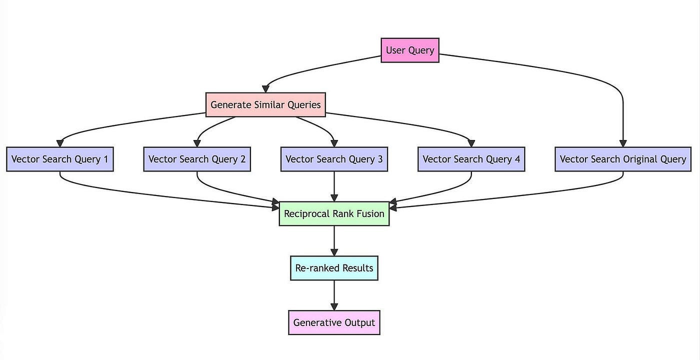
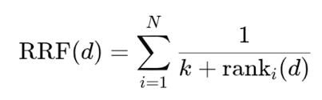

## RAG Fusion
- RAG-Fusion is an advanced Retrieval-Augmented Generation technique that enhances search accuracy by generating multiple, varied queries from a single user prompt and using "Reciprocal Rank Fusion" (RRF) to re-rank results.

### Steps:
1. Multiple query Generation from user input query or prompt.
2. With multiple queries pull data/chunks from vector databases.
3. Instead of just taking the top results, RAG-Fusion ranks the combined documents from all queries based on a combined score.
4. Re-rank the results based on scores. 
5. Relevant context is passed to the LLM to generate the final, accurate answer. 

## Reciprocal Rank Fusion
- Reciprocal Rank Fusion is a rank aggregation method that combines rankings from multiple sources into a single, unified ranking.
- In simple words, all ranked results from different queries are given a score. Let’s suppose we have 3 query retrieved chunks like (A, B, C), (A, C, D), (B, A, C). Each item gets a score based on its rank position using the formula, and then by summing the scores for A, B, C, and D, we get a total score. Finally, we re-rank them based on this total score.

